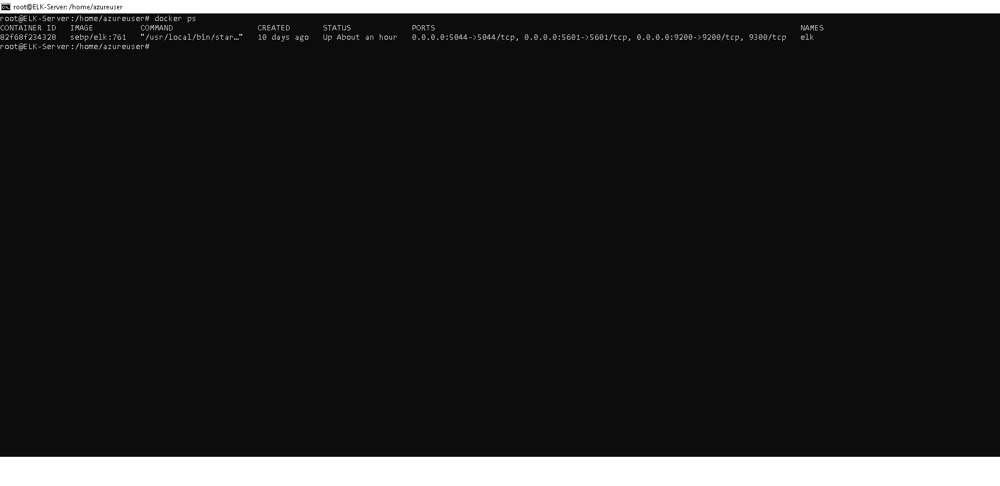

## Automated ELK Stack Deployment

The files in this repository were used to configure the network depicted below.

(![TODO: Update the path with the name of your diagram])(Images/carlos_gonzalez_unit_13_projectdrawio.drawio.png)

These files have been tested and used to generate a live ELK deployment on Azure. They can be used to either recreate the entire deployment pictured above. Alternatively, select portions of the YAML file may be used to install only certain pieces of it, such as Filebeat.

  - _TODO: Images/install_elk_yml.png
  -

This document contains the following details:
- Description of the Topology
- Access Policies
- ELK Configuration
  - Beats in Use
  - Machines Being Monitored
- How to Use the Ansible Build

### Description of the Topology

The main purpose of this network is to expose a load-balanced and monitored instance of DVWA, the D*mn Vulnerable Web Application.

Load balancing ensures that the application will be highly available, in addition to restricting inbound access to the network.
- _TODO: Load balancers provide an added layer of security. Sitting between clients and servers, directing traffic, distributing network load accross multiple servers, and ensuring availability.  
What is the advantage of a jump box? A jump box is a secure computer which allows administrators to connect into before to jump and control other servers, containers and other devices in the network.   

Integrating an ELK server allows users to easily monitor the vulnerable VMs for changes to the data and system logs.
- _TODO: What does Filebeat watch for? System Logs from servers
- _TODO: What does Metricbeat record? Metric Data from servers

The configuration details of each machine may be found below.
_Note: Use the [Markdown Table Generator](http://www.tablesgenerator.com/markdown_tables) to add/remove values from the table_.

| Name                | Function | IP Address | Operating System |
|---------------------|----------|------------|------------------|
|Jump-Box-Provisioner | Gateway  | 10.0.0.1   | Linux            |
|Web-1                |Webserver | 10.0.0.5   | Linux            |
|Web-2                |Webserver | 10.0.0.6   | Linux            |
|ELK-Server           |Monitor   | 10.1.0.4   | Linux            |

### Access Policies

The machines on the internal network are not exposed to the public Internet. 

Only the elk-server machine can accept connections from the Internet. Access to this machine is only allowed from the following IP addresses:
- _TODO: 172.124.189.20 via http traffic port 5016_

Machines within the network can only be accessed by jump-box-provisioner via ssh
- _TODO: Which machine did you allow to access your ELK VM? My PC @ " What was its IP address?172.124.189.20

A summary of the access policies in place can be found in the table below.

| Name                | Publicly Accessible | Allowed IP Addresses |
|---------------------|---------------------|----------------------|
|Jump-Box-Provisioner | Yes                 | 172.124.189.20       |
|Web-1                | No                  | 10.1.0.4             |
|Web-2                | No                  | 10.1.0.4             |
|ELK-Server           | Yes                 | 172.124.189.20       |

### Elk Configuration

Ansible was used to automate configuration of the ELK machine. No configuration was performed manually, which is advantageous because...
- _TODO: automating configurations with Ansible simplifies complex tasks, allow admins to better manage and focus attention on other duties responsibilities. 

The playbook implements the following tasks:
- _TODO: In 3-5 bullets, explain the steps of the ELK installation play. E.g., install Docker; download image; etc._
- Install docker.io
- Install python3-pip
- Install Docker [[python]] module
- Increase virtual memory
- Download and launch a docker elk container
- Enable service docker on boot
The following screenshot displays the result of running `docker ps` after successfully configuring the ELK instance.

### Target Machines & Beats
This ELK server is configured to monitor the following machines:
- _TODO: VM Name = Web-1  IP address: 10.0.0.5
         VM Name = Web-2  IP address: 10.0.0.6

We have installed the following Beats on these machines:
- _TODO: filebeat-7.4.0-amd64 & metricbeat-8.0

These Beats allow us to collect the following information from each machine:
- _Filebeat - collects system logs from servers
- _Metricbeat - collects metric data from servers

### Using the Playbook
In order to use the playbook, you will need to have an Ansible control node already configured. Assuming you have such a control node provisioned: 

SSH into the control node and follow the steps below:
- Copy the playbook file to Ansible Control.
- Update the hosts file to include webservers & elk server
- Run the playbook, and navigate to Kibana to check that the installation worked as expected.

_TODO: Answer the following questions to fill in the blanks:_
- _Which file is the playbook? Where do you copy it? Ansible Control
- _Which file do you update to make Ansible run the playbook on a specific machine? How do I specify which machine to install the ELK server on versus which to install Filebeat on? hosts file
- _Which URL do you navigate to in order to check that the ELK server is running? http://40.83.247.132:5601/

_As a **Bonus**, provide the specific commands the user will need to run to download the playbook, update the files, etc._